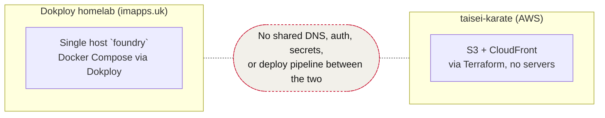

# Infra docs — index

Knowledge base for how everything we run is deployed and wired together. Two independent stacks, documented separately because they share no infrastructure:

- **[`homelab.md`](./homelab.md)** — the Dokploy homelab (`imapps.uk`): everything in this `foundry` repo, single host, Cloudflare tunnel + Access, NFS storage.
- **[`taisei-karate.md`](./taisei-karate.md)** — `taisei-karate`'s AWS deployment (sibling repo): Astro static site on S3 + CloudFront via Terraform, GitHub Actions OIDC, no servers.

## Secrets

**Vaultwarden is live** at `vault.imapps.uk` (deployed 2026-08-23, `infra` project — see [`homelab.md` §5](./homelab.md#5-projects--services-dokploy-inventory)), pinned `1.37.2`, NFS-backed, no SMTP. Owner account + TOTP 2FA done, `ADMIN_TOKEN` set (Argon2id hash, admin panel confirmed gated), `SIGNUPS_ALLOWED=false`.

CLI tooling for it lives in `~/dotfiles` (stow package `bin` → `~/.local/bin`, on `$PATH` on every machine that's stowed it), not per-repo — see the full plan at
`docs/superpowers/plans/2026-08-23-vaultwarden-secrets-migration.md`:

- `bw-import-file <item-name> <file-path>` — upserts a file's contents into a Secure Note (creates or updates in place).
- `pull-env <item-name> [out-file]` — writes a Secure Note's contents to a local file (default `.env`), for tools that need a real file on disk.
- `bw-run <item-name> -- <command...>` — runs a dev command with the note's `KEY=VALUE` lines exported into that process only, no file ever written. e.g. `bw-run "kivo .env" -- bun run dev`.
- `bw-run-compose <item-name> -- <compose args...>` — same idea for `docker compose`, which needs an `--env-file` path: writes a private (`0600`) temp file for the call's duration only, then deletes it. e.g. `bw-run-compose "mixtape .env" -- up`.

Known non-empty app `.env`s found on this machine so far: `kivo`, `mixtape`, `shoppingo` (`jewellery-catalogue`'s isn't on this machine — pull it from wherever it's actually used before migrating). Migration into vault items and eventually dropping the on-disk `.env`s entirely in favor of `bw-run` is tracked on the plan/kanban board, not yet done.

`taisei-karate`'s secrets stay as GitHub Actions secrets regardless (OIDC model, see [`taisei-karate.md` §5](./taisei-karate.md#5-secrets--auth-model)) — Vaultwarden is for personal/homelab credentials, not CI secrets. Dokploy's own per-app environment panel (prod runtime secrets) stays as the deploy-time source of truth too — see the note in the plan doc on why that isn't being centralized into Vaultwarden.

## Keeping this current

These docs are only useful if they don't drift from what's actually deployed. When you change something (new service, port, domain, IAM policy, whatever):

1. Make the change (compose file / Terraform / Cloudflare config).
2. Update the relevant doc in this directory **in the same session**, not as a follow-up.
3. If it's a new finding rather than a change (e.g. an exposed port you noticed), add it to `../SECURITY-AUDIT.md` instead of just mentioning it in chat — chat context doesn't survive between sessions, these files do.

If a doc and the real infra disagree, the real infra wins — fix the doc, don't assume the doc was right.
