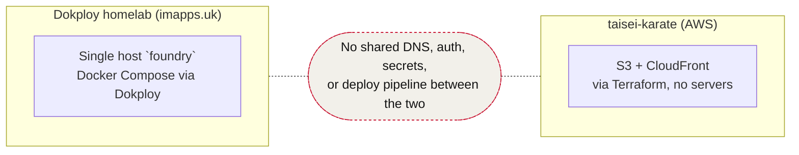

# Infra docs — index

Knowledge base for how everything we run is deployed and wired together. Two independent stacks, documented separately because they share no infrastructure:

- **[`homelab.md`](./homelab.md)** — the Dokploy homelab (`imapps.uk`): everything in this `foundry` repo, single host, Cloudflare tunnel + Access, NFS storage.
- **[`taisei-karate.md`](./taisei-karate.md)** — `taisei-karate`'s AWS deployment (sibling repo): Astro static site on S3 + CloudFront via Terraform, GitHub Actions OIDC, no servers.

## Secrets

**Vaultwarden is live** at `vault.imapps.uk` (deployed 2026-08-23, `infra` project — see [`homelab.md` §5](./homelab.md#5-projects--services-dokploy-inventory)), pinned `1.37.2`, NFS-backed, no SMTP, `SIGNUPS_ALLOWED=true` only until the one owner account exists.

Remaining steps (not yet done):
1. Create the owner account, turn on **TOTP 2FA** immediately.
2. Generate the Argon2id `ADMIN_TOKEN` hash (`docker run --rm -it vaultwarden/server:1.37.2 /vaultwarden hash`) and set it directly in Dokploy's env panel — not in git, not pasted into chat.
3. Flip `SIGNUPS_ALLOWED` to `false`, redeploy.
4. Migrate `~/notes/secrets/tokens.md` in via a one-time Bitwarden export/import, point the official Bitwarden clients at `https://vault.imapps.uk`, then retire the plaintext file.

`taisei-karate`'s secrets stay as GitHub Actions secrets regardless (OIDC model, see [`taisei-karate.md` §5](./taisei-karate.md#5-secrets--auth-model)) — Vaultwarden is for personal/homelab credentials, not CI secrets.

## Keeping this current

These docs are only useful if they don't drift from what's actually deployed. When you change something (new service, port, domain, IAM policy, whatever):

1. Make the change (compose file / Terraform / Cloudflare config).
2. Update the relevant doc in this directory **in the same session**, not as a follow-up.
3. If it's a new finding rather than a change (e.g. an exposed port you noticed), add it to `../SECURITY-AUDIT.md` instead of just mentioning it in chat — chat context doesn't survive between sessions, these files do.

If a doc and the real infra disagree, the real infra wins — fix the doc, don't assume the doc was right.
