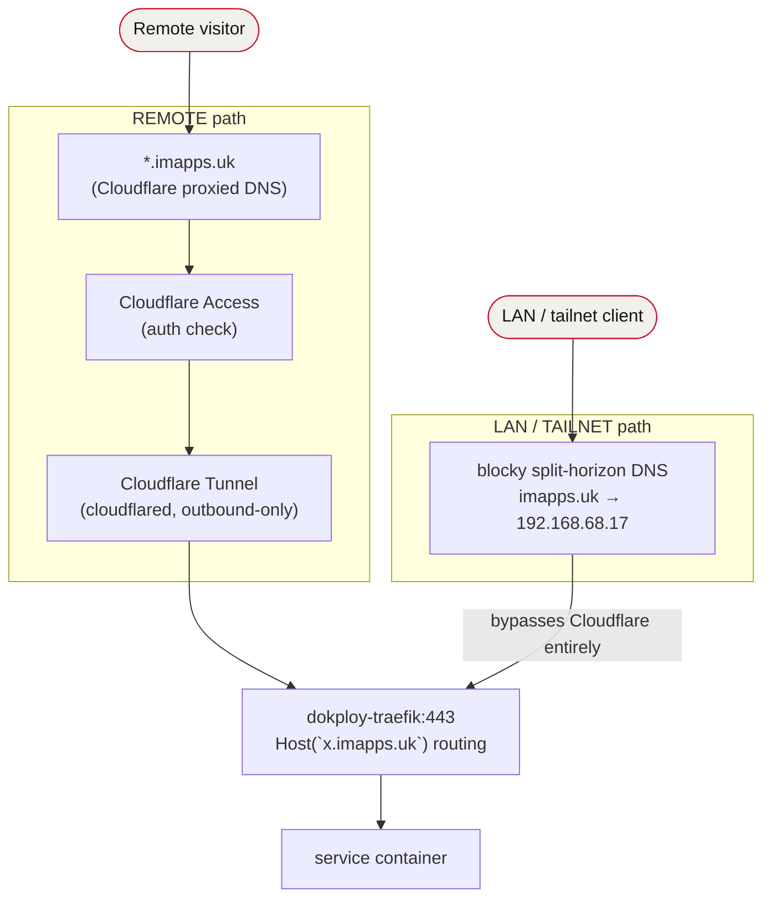

# Homelab — imapps.uk (Dokploy)

Agent-oriented map of how the Dokploy homelab fits together: topology, deploy flow, MCP control planes, service inventory, storage, DNS, and the Cloudflare Access model. Read this first before touching anything here.

> Companion docs: [`taisei-karate.md`](./taisei-karate.md) (separate AWS stack, not part of this homelab), `../SECURITY-AUDIT.md` (open findings), `../README.md` (blocky quickstart).

---

## 1. Physical / network topology

| Plane | Address | Notes |
|---|---|---|
| Dokploy host (`foundry`) LAN | `192.168.68.17` | single node, runs everything |
| Dokploy host WAN | `92.40.218.136` | no inbound port-forward except none needed (tunnel is outbound) |
| Dokploy host tailnet | `100.79.92.93` | tailscale, MagicDNS name `foundry` |
| NAS (NFS) | `192.168.68.13` | `/mnt/tank/shared/*` — backing store for most volumes |
| LAN gateway | `192.168.68.1` | |

Single Docker host. No swarm cluster. Everything is Docker Compose stacks managed by Dokploy.

> Host was reinstalled bare-metal on 2026-08-20 (previously Proxmox), which changed LAN/tailnet IPs from `.18`/`100.85.189.60` to the values above — confirmed against the live `mongodb`/`minio`/`blocky` compose files and the `blocky` fix-hardcoded-IPs deployment, not from a prior copy of this doc. If you find another IP reference anywhere (scripts, other notes), it's stale — this file and the live compose files are the source of truth.

## 2. Ingress & DNS (how a request reaches a service)

- **One Cloudflare tunnel** `0da10189-66a3-49f1-b138-f1f617592567` → wildcard `*.imapps.uk` (proxied) → `dokploy-traefik:443` → Traefik hostname routing.
- **blocky** (`infra/blocky`) does split-horizon DNS: `imapps.uk → 192.168.68.18`. On LAN/tailnet, traffic goes straight to Traefik and **bypasses Cloudflare + Access**. → **CF Access only protects REMOTE traffic. Zero protection on LAN/tailnet.**
- Traefik entrypoints: `web` (80, redirect→https), `websecure` (443, letsencrypt certresolver). Services attach via `dokploy-network` + traefik labels.
- Internal service-to-service DB access uses blocky names resolving to the host bind: `infra-mongodb.imapps.uk:27017`, `minio-ui.imapps.uk:9000`.

## 3. Deploy flow (CRITICAL — read before any change)

IaC repo: `/home/igors/imapps/foundry` → `git@github.com:igor-siergiej/foundry.git`.

- **Dokploy deploys from GitHub HEAD, not local files.** Compose changes must be **commit + push** first.
- `autoDeploy=true` but the **webhook is unreliable — do NOT trust it to fire.** After push, deploy explicitly via `compose-deploy` (dokploy-mcp).
- **`git push` needs `dangerouslyDisableSandbox: true`** (sandbox has no network egress; DNS to github.com is flaky — retry fetch).
- App code images (shoppingo, jewellery-catalogue, kivo, sentinel, mixtape) are built + pushed by each app's own repo CI to Docker Hub `igurusama/imapps:<tag>`, then Dokploy pulls. `pull_policy: always` on `:latest` tags forces re-pull.

## 4. MCP control planes (how an agent operates this homelab)

| MCP | Transport | Scope / capability | Gaps |
|---|---|---|---|
| **dokploy-mcp** | deferred tools (load via `ToolSearch select:<name>`) | full Dokploy API: projects, compose/app CRUD + deploy, docker, domains, backups, env, users | API key lacks `sso-listProviders` + `auditLog-all` (both 403) |
| **cloudflare** (`mcp__cloudflare__*`) | OAuth remote MCP `https://mcp.cloudflare.com/mcp` | Account `ddf9791b93ad2e4cc5ef56aedfd7bd72`, zone `imapps.uk` = `e8069a9a6e586db3add05a408bd1e2d0`. Has **Access:Edit** | **lacks Zone WAF/Rulesets** — rate-limit rules need a scoped API token via `curl` |
| **playwright** | `mcp-cli --config ~/.mcp_servers.json` | browser automation | — |

Notes:
- dokploy-mcp tools are **deferred**: the schema must be loaded with `ToolSearch` query `select:mcp__dokploy-mcp__<tool>` before calling.
- Global `~/.mcp_servers.json` only contains playwright. dokploy + cloudflare are wired as first-class deferred MCPs in this harness, not in that file.
- **This shell runs on the user's LAPTOP (`framework`), not the Dokploy host.** No docker locally; local `ss`/port checks are meaningless for the server. Reach the host via tailscale (`100.85.189.60` / `foundry`).

## 5. Projects & services (Dokploy inventory)

Org `QhuDFk1KJXDHR2xy0nwcK`. 4 projects, all in `production` environment.

### `apps`
| Service | Type | Host | Notes |
|---|---|---|---|
| shoppingo-web / shoppingo-api | app | shoppingo.imapps.uk | api uses OpenAI + mongo + minio |
| jewellery-catalogue-web / -api | app | jewellery-catalogue.imapps.uk | mongo + minio |
| kivo | app | kivo.imapps.uk | mongo; own JWT auth |

### `nas` (compose stacks, media)
| Stack | Image | Container port | Ingress |
|---|---|---|---|
| immich | `immich-server:v2.7.3` (+ ml, redis, pg16) | 2283 | immich.imapps.uk — **Access bypass**, own login |
| jellyfin | `jellyfin:10.9.11` | 8096 | jellyfin.imapps.uk — bypass |
| navidrome | `navidrome:latest` | 4533 | navidrome.imapps.uk — bypass |
| audiobookshelf | `audiobookshelf:latest` | 13378 | audiobookshelf.imapps.uk — bypass |
| mixtape | `igurusama/imapps:mixtape-{api,web}-latest` | 3000 | mixtape.imapps.uk — bypass; YouTube→mp3 into Navidrome NFS share |

None of these publish a host port (`ports:` block) — confirmed against the live compose files. "Container port" is what Traefik routes to internally via `dokploy-network`; nothing here is reachable by hitting the host IP directly on that port. (This was tightened in the 2026-07-04 hardening pass — see git log on this repo for `harden: remove 0.0.0.0 host ports` if you need the before/after.)

### `infra`
| Stack | Image | Ports | Notes |
|---|---|---|---|
| cloudflared | (app) | — | the tunnel |
| tailscale | `tailscale:latest` | host net | `network_mode: host`, advertises route `192.168.68.0/24` |
| blocky | `spx01/blocky:latest` | 53 (host-published, LAN DNS) | split-horizon DNS; web UI/metrics now internal-only via `dokploy-network` (`:4000` host publish dropped in the 2026-07-04 hardening pass) |
| mongodb | `mongo:7.0` | 27017, host-published bound to `192.168.68.17` + `100.79.92.93` only | shared DB (kivo, shoppingo, jewellery, mixtape). NFS-backed |
| minio | `minio:latest` | 9000/9001, host-published bound to `192.168.68.17` + `100.79.92.93` only | S3 for apps. `minio-data` external volume |
| monitoring | loki/promtail/prometheus/cadvisor/node-exporter/grafana/gatus | grafana(Traefik), gatus 8080 | grafana.imapps.uk, gatus.imapps.uk |
| home-assistant | `home-assistant:2024.12.3` | 8123 | `privileged`, NET_ADMIN/NET_RAW |
| **vaultwarden** *(planned)* | `vaultwarden/server:latest` | — | self-hosted secrets/password vault, replaces plaintext `~/notes/secrets/tokens.md`; see [`README.md`](./README.md#secrets) |

### `sentinel`
| Service | Host | Notes |
|---|---|---|
| web / api | sentinel.imapps.uk | own require-email Access app; api holds HA long-lived token; embeds gatus iframe |

## 6. Cloudflare Access model (set 2026, default-deny)

- **Wildcard `*.imapps.uk`** app = require owner email (`igorsiergiej@gmail.com` + `gregormai@mail.de`). Catches everything not explicitly bypassed — incl. grafana, home-assistant, minio/mongo HTTP routes.
- **Explicit Bypass** apps (public / own-auth): immich, shoppingo, jewellery-catalogue, kivo, mixtape, audiobookshelf, jellyfin, navidrome, gatus.
- **dokploy** + **sentinel** keep their own require-email apps.
- immich has a rate-limit rule on `/auth/login` (15 req / 10s / IP → block).
- Reminder: Access is a **remote-only** gate (see §2). On tailnet, own-auth is the only protection.

## 7. Storage

- Most volumes are **NFS on the NAS `192.168.68.13`** (`/mnt/tank/shared/*`): immich uploads, mongodb data, loki/prometheus/grafana/gatus, navidrome music (shared read-write by mixtape, read-only by navidrome).
- **Local (host-disk) volumes with no NFS + no backup:** `immich-pgdata`, `minio-data` (external). Host disk loss = data loss. See `../SECURITY-AUDIT.md` #5.

## 8. Gotchas checklist (for future agents)

- [ ] Compose change → commit + push (`dangerouslyDisableSandbox:true`) → **explicit `compose-deploy`** (webhook unreliable).
- [ ] dokploy-mcp tools are deferred — `ToolSearch select:` before use.
- [ ] Cloudflare MCP can't do WAF/rate-limit — use a scoped API token + `curl`, then revoke it.
- [ ] You are on the laptop, not the host. Use tailscale to reach `foundry`. Laptop may be off home wifi.
- [ ] Some public wifi has a middlebox that ACKs every SYN → false "port OPEN". Judge reachability by real protocol replies (HTTP body, mongo wire), not raw connect.
- [ ] Access protects remote only; LAN/tailnet bypasses it via blocky split-horizon.
- [ ] **This doc drifted from reality once already** (stale `.18`/`100.85.189.60` host IPs from before the 2026-08-20 bare-metal migration, a stale "host port" claim for services hardened on 2026-07-04) — found and fixed 2026-08-23 by cross-checking the live compose files instead of trusting the doc. If something here looks surprising, check the actual compose file / `dokploy-mcp` state before trusting this doc over it.
- [ ] **This homelab and `taisei-karate` (AWS) share no infrastructure** — different clouds, different auth models, different deploy pipelines. See [`taisei-karate.md`](./taisei-karate.md).
