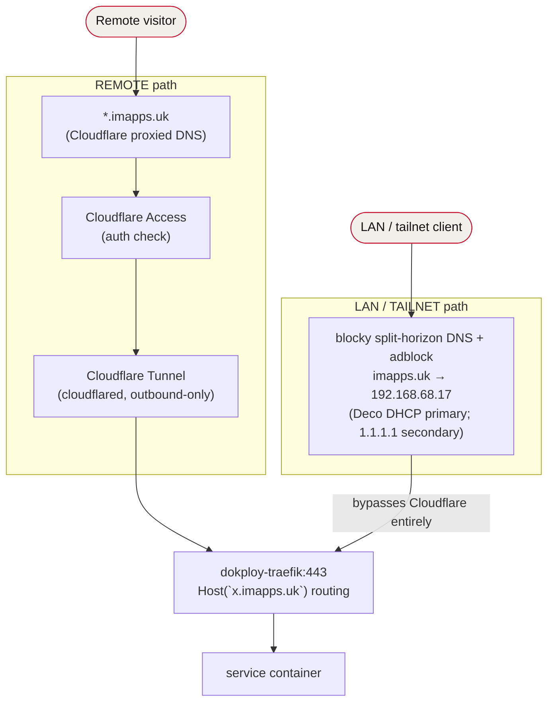

# Homelab — imapps.uk (Dokploy)

Agent-oriented map of how the Dokploy homelab fits together: topology, deploy flow, MCP control planes, service inventory, storage, DNS, and the Cloudflare Access model. Read this first before touching anything here.

> Companion docs: [`taisei-karate.md`](./taisei-karate.md) (separate AWS stack, not part of this homelab), `../SECURITY-AUDIT.md` (open findings), `../README.md` (blocky quickstart).

---

## 1. Physical / network topology

| Plane | Address | Notes |
|---|---|---|
| Dokploy host (`foundry`) LAN | `192.168.68.17` | single node, runs everything |
| Dokploy host WAN | `92.40.218.136` | no inbound port-forward except none needed (tunnel is outbound) |
| Dokploy host tailnet | `100.79.92.93` | tailscale, MagicDNS name `foundry` |
| `192.168.68.13` | — | Responds to ICMP only, no open service ports; **not** an active dependency — see §7. Stale from before the 2026-08-20 bare-metal migration. |
| LAN gateway | `192.168.68.1` | |

Single Docker host. No swarm cluster. Everything is Docker Compose stacks managed by Dokploy.

> Host was reinstalled bare-metal on 2026-08-20 (previously Proxmox), which changed LAN/tailnet IPs from `.18`/`100.85.189.60` to the values above — confirmed against the live `mongodb`/`minio`/`blocky` compose files and the `blocky` fix-hardcoded-IPs deployment, not from a prior copy of this doc. If you find another IP reference anywhere (scripts, other notes), it's stale — this file and the live compose files are the source of truth.

## 2. Ingress & DNS (how a request reaches a service)


```mermaid
flowchart TB
    remoteUser([Remote visitor]):::ext
    lanUser([LAN / tailnet client]):::ext

    subgraph remote["REMOTE path"]
        cfdns["*.imapps.uk<br/>(Cloudflare proxied DNS)"]
        access["Cloudflare Access<br/>(auth check)"]
        tunnel["Cloudflare Tunnel<br/>(cloudflared, outbound-only)"]
    end

    subgraph lan["LAN / TAILNET path"]
        blocky["blocky split-horizon DNS + adblock<br/>imapps.uk → 192.168.68.17<br/>(Deco DHCP primary; 1.1.1.1 secondary)"]
    end

    traefik["dokploy-traefik:443<br/>Host(`x.imapps.uk`) routing"]
    svc["service container"]

    remoteUser --> cfdns --> access --> tunnel --> traefik
    lanUser --> blocky -->|bypasses Cloudflare entirely| traefik
    traefik --> svc

    classDef ext fill:#f2f0ea,stroke:#c8102e,color:#141414;
```

- **One Cloudflare tunnel** `0da10189-66a3-49f1-b138-f1f617592567` → wildcard `*.imapps.uk` (proxied) → `dokploy-traefik:443` → Traefik hostname routing.
- **blocky** (`infra/blocky`) does split-horizon DNS: `imapps.uk → 192.168.68.17` (the host's reserved LAN IP). On LAN/tailnet, traffic goes straight to Traefik and **bypasses Cloudflare + Access**. → **CF Access only protects REMOTE traffic. Zero protection on LAN/tailnet.**
- Since 2026-09-22 the **Deco hands out `192.168.68.17` as DHCP primary DNS** (secondary `1.1.1.1`), so this applies to *every* device on the WiFi, not just tailnet clients. blocky also runs StevenBlack adware+malware blocklists for the whole LAN.
- **Except it wasn't reaching `foundry`.** On 2026-09-27 the host's own DHCP lease still carried the ISP resolvers `188.31.250.128/129`, not `192.168.68.17` — so the box running blocky was the one device not using it. The host is now pinned in netplan (§4a); the Deco setting was left alone, so **assume other long-lease devices may be in the same state** and spot-check one before trusting LAN-wide adblock numbers.
- **Secondary-DNS caveat:** during a blocky restart a client can fall through to `1.1.1.1`, receive the Cloudflare-proxied answer for `*.imapps.uk`, and hit an Access prompt until that ~300s TTL expires. Accepted trade-off vs. losing all internet when blocky is down.
- Traefik entrypoints: `web` (80, redirect→https), `websecure` (443, letsencrypt certresolver). Services attach via `dokploy-network` + traefik labels.
- Internal service-to-service DB access goes container-to-container over
  `dokploy-network`: `mongodb:27017`, `minio:9000`. It deliberately does not
  use `*.imapps.uk` names — those resolve via blocky to the host LAN IP, so a
  DHCP lease change would break every app (it did, 2026-09-19). Any service
  needing mongo or minio must join `dokploy-network`.

## 3. Deploy flow (CRITICAL — read before any change)

IaC repo: `/home/home/imapps/foundry` on this host (path may differ on other machines) → `git@github.com:igor-siergiej/foundry.git`.

- **Dokploy deploys from GitHub HEAD, not local files.** Compose changes must be **commit + push** first.
- `autoDeploy=true` but the **webhook is unreliable — do NOT trust it to fire.** After push, deploy explicitly via `compose-deploy` (dokploy-mcp).
- **`git push` needs `dangerouslyDisableSandbox: true`** (sandbox has no network egress; DNS to github.com is flaky — retry fetch).
- App code images (shoppingo, jewellery-catalogue, kivo, sentinel, mixtape) are built + pushed by each app's own repo CI to Docker Hub `igurusama/imapps:<tag>`, then Dokploy pulls. `pull_policy: always` on `:latest` tags forces re-pull.

## 4. MCP control planes (how an agent operates this homelab)

Two reachability tiers — don't assume a server is a native deferred tool just because it's configured somewhere:

| MCP | Reachability | Scope / capability | Gaps |
|---|---|---|---|
| **dokploy-mcp** | `mcp-cli --config ~/.mcp_servers.json call-tool dokploy-mcp:<tool>` | full Dokploy API: projects, compose/app CRUD + deploy, docker, domains, backups, env, users | API key lacks `sso-listProviders` + `auditLog-all` (both 403) |
| **cloudflare-api** | `mcp-cli --config ~/.mcp_servers.json call-tool cloudflare-api:<tool>` | remote MCP `https://mcp.cloudflare.com/mcp`. Account `ddf9791b93ad2e4cc5ef56aedfd7bd72`, zone `imapps.uk` = `e8069a9a6e586db3add05a408bd1e2d0`. Has **Access:Edit** | **lacks Zone WAF/Rulesets** — rate-limit rules need a scoped API token via `curl` |
| **grafana** | `mcp-cli --config ~/.mcp_servers.json call-tool grafana:<tool>` | dashboards/alerts at `grafana.imapps.uk` | — |
| **tailscale** | `mcp-cli --config ~/.mcp_servers.json call-tool tailscale:<tool>` | tailnet admin (OAuth client, write risk allowed) | — |
| **trello** | `mcp-cli --config ~/.mcp_servers.json call-tool trello:<tool>` | board `6a8ace741220b3624276fdf6` | — |
| **playwright** | native deferred tool (`mcp__plugin_playwright_playwright__*`) — ALSO in `~/.mcp_servers.json` for `mcp-cli` use outside Claude Code | browser automation | — |
| **github** | native deferred tool, plugin-managed (`plugin:github:github`, `api.githubcopilot.com`) | repo/PR/issue ops | needs `GITHUB_PERSONAL_ACCESS_TOKEN` in env at Claude Code launch (via `bw-run "github.pat" -- claude`) or it fails to connect |

Notes:
- **None of dokploy/cloudflare/grafana/tailscale/trello are native Claude Code deferred tools** — they're `mcp-cli`-CLI-only, by design (see user CLAUDE.md: avoids deferred-tool context bloat). Only Gmail/Drive/Calendar/Figma/GitHub/Playwright are registered natively (check with `claude mcp list`).
- `~/.mcp_servers.json` is vault-rendered (see dotfiles `docs/secrets.md`), not hand-edited — the checked-in shape lives at dotfiles `docs/mcp_servers.json.template`.
- **`~` is not `/home/home` inside a Paperclip agent run.** Paperclip sandboxes `HOME` to a per-run temp dir, so every `~/.mcp_servers.json` above resolves to a nonexistent file and *all* of these MCPs look unreachable. Use the absolute path — `mcp-cli --config /home/home/.mcp_servers.json call-tool dokploy-mcp:<tool>`. Verified working 2026-09-27.
- **MagicDNS on `foundry` — broken until 2026-09-27, now fixed.** See §4a. If `*.ts.net` stops resolving here again, that's the thing to check: the Paperclip control-plane MCPs (`home.tail2d4575.ts.net:8444`) fail at session start with `ENOTFOUND` and the fallback is `curl --resolve <host>:<port>:100.79.92.93`.
- **`cloudflare-api` needs a one-time OAuth sign-in.** Its config entry is now an `npx mcp-remote` stdio wrapper (`mcp-cli` only speaks stdio; the old url-only entry failed with `The "file" argument must be of type string`). The wrapper works, but the first call blocks on Cloudflare's OAuth — see §4b for the sign-in procedure. Until someone completes it, everything this repo says about Cloudflare Access is carried forward from docs, unverified.
- **Don't assume which machine you're on.** A SessionStart hook (`~/.claude/hooks/machine-context.sh`, dotfiles-managed) injects machine identity (hostname/tailscale IP → known role, e.g. this box IS `foundry` itself with direct docker access) at session start — read that context instead of assuming "laptop, reach host via tailscale". If the hook reports "unrecognized machine", check `hostname`/`tailscale status` yourself before trusting anything below that assumes a specific box.

## 4a. Host DNS resolution on `foundry` (fixed 2026-09-27)

**What was wrong.** `tailscaled` runs as a *host-network Docker container* (`infra-tailscale`,
`TS_USERSPACE=false`). Host networking means `tailscale0` and the `100.100.100.100` stub resolver
land in the host netns — so routing worked and `dig @100.100.100.100` always answered — but the
container keeps its own **mount** namespace, so every `/etc/resolv.conf` tailscaled wrote went into
the container and the host never saw it. `tailscale set --accept-dns=true` cannot fix that.
Separately, DHCP was handing this box the ISP resolvers `188.31.250.128/129` rather than blocky,
despite the Deco being configured to advertise `192.168.68.17`. Net effect: no `*.ts.net`, no
split-horizon `*.imapps.uk`, no adblock, on the host itself.

**How it's fixed, in two halves:**

1. **blocky forwards `ts.net`** — `blocky/config.yml` has `conditional.mapping.ts.net:
   100.100.100.100`. Bridge containers can reach the stub through the host's `100.64.0.0/10` route,
   so this works from inside blocky. This gives MagicDNS to *every* LAN client, not just the host.
2. **The host is pinned to blocky** — `/etc/netplan/00-installer-config.yaml` now sets
   `dhcp4-overrides.use-dns: false` plus `nameservers.addresses: [192.168.68.17, 1.1.1.1]` and
   `search: [tail2d4575.ts.net]`. Previous file backed up alongside as `.bak-2026-09-27`.
   Applied with `netplan generate && networkctl reload` (no link bounce).

**Ordering hazard:** the host's primary resolver is now a container on the host. `1.1.1.1` is the
secondary, so a blocky restart degrades rather than breaks DNS — but it means *never* leave blocky
down while doing anything that needs name resolution to bring it back. `blocky` is `restart: always`
for this reason.

**Note `/etc/resolv.conf` is in `uplink` mode, not `stub`.** blocky binds `0.0.0.0:53`, which
collides with systemd-resolved's `127.0.0.53:53` stub listener, so the stub is disabled. That means
per-domain split DNS via `resolvectl domain <link> ~domain` has **no effect** — resolv.conf points
clients straight at the link's uplink servers. Route domains through blocky's config instead.

Verify all three paths in one go:

```sh
getent hosts home.tail2d4575.ts.net   # 100.79.92.93   - MagicDNS
getent hosts dokploy.imapps.uk        # 192.168.68.17  - split horizon
getent hosts github.com               # public         - upstream
```

## 4b. Signing `cloudflare-api` in (one-time, needs a human browser)

`mcp-remote` derives a **fixed** callback port from the server URL: `28491`. It binds
`127.0.0.1:28491` on whichever box runs it, and stores the resulting token in `~/.mcp-auth`, so the
sign-in survives across sessions and only has to happen once per machine.

From a machine with a browser, tunnel that port to `foundry` and run the flow there:

```sh
ssh -L 28491:localhost:28491 home@foundry
# in that session:
MCP_REMOTE_CONFIG_DIR=/home/home/.mcp-auth \
  npx -y mcp-remote@latest https://mcp.cloudflare.com/mcp --transport http-only
# paste the printed https://mcp.cloudflare.com/authorize?... URL into your local browser
```

Agents then use it normally, but **must** pin the auth dir, because Paperclip sandboxes `HOME`:

```sh
MCP_REMOTE_CONFIG_DIR=/home/home/.mcp-auth \
  mcp-cli --config /home/home/.mcp_servers.json call-tool cloudflare-api:<tool> --args '{}'
```

If the token is missing or expired the call doesn't error — it **hangs** on
`Authentication required. Waiting for authorization...`. Always run it under `timeout`.

## 5. Projects & services (Dokploy inventory)

Org `QhuDFk1KJXDHR2xy0nwcK`. 4 projects, all in `production` environment.

### `apps`
| Service | Type | Host | Notes |
|---|---|---|---|
| shoppingo-web / shoppingo-api | app | shoppingo.imapps.uk | api uses OpenAI + mongo + minio |
| jewellery-catalogue-web / -api | app | jewellery-catalogue.imapps.uk | mongo + minio |
| kivo | app | kivo.imapps.uk | mongo; own JWT auth |

### `nas` (compose stacks, media)
| Stack | Image | Container port | Ingress |
|---|---|---|---|
| immich | `immich-server:v3.2.0` (+ ml, redis, pg16) | 2283 | immich.imapps.uk — **Access bypass**, own login |
| jellyfin | `jellyfin:10.9.11` | 8096 | jellyfin.imapps.uk — bypass |
| navidrome | `navidrome:latest` | 4533 | navidrome.imapps.uk — bypass |
| audiobookshelf | `audiobookshelf:latest` | 13378 | audiobookshelf.imapps.uk — bypass |
| mixtape | `igurusama/imapps:mixtape-{api,web}-latest` | 3000 | mixtape.imapps.uk — bypass; YouTube→mp3 into Navidrome NFS share |

None of these publish a host port (`ports:` block) — confirmed against the live compose files. "Container port" is what Traefik routes to internally via `dokploy-network`; nothing here is reachable by hitting the host IP directly on that port. (This was tightened in the 2026-07-04 hardening pass — see git log on this repo for `harden: remove 0.0.0.0 host ports` if you need the before/after.)

### `infra`
| Stack | Image | Ports | Notes |
|---|---|---|---|
| cloudflared | (app) | — | the tunnel |
| tailscale | `tailscale:latest` | host net | `network_mode: host`, advertises route `192.168.68.0/24` |
| blocky | `spx01/blocky:latest` | 53 (host-published, LAN DNS) | split-horizon DNS; web UI/metrics now internal-only via `dokploy-network` (`:4000` host publish dropped in the 2026-07-04 hardening pass) |
| mongodb | `mongo:7.0` | 27017, **no host publish, no Traefik route** (internal-only on `dokploy-network`) | shared DB (kivo, shoppingo, jewellery, mixtape). ZFS bind mount. Admin: `docker exec -it mongodb mongosh`, or the socat tunnel in [`../mongodb/README.md`](../mongodb/README.md#remote-access) |
| minio | `minio:latest` | 9000/9001, **no host publish** — Traefik only: `minio.imapps.uk` → 9000 (S3), `minio-console.imapps.uk` → 9001 (console) | S3 for apps (they use `minio:9000` internally). `minio-data` external volume. Host publishes (LAN, then tailnet) dropped 2026-10-10 |
| monitoring | loki/promtail/prometheus/cadvisor/node-exporter/grafana/gatus | grafana(Traefik), gatus 8080 | grafana.imapps.uk, gatus.imapps.uk |
| home-assistant | `home-assistant:2024.12.3` | 8123 | unprivileged bridge container (no host devices; `privileged` + NET_ADMIN/NET_RAW dropped 2026-10-10) |
| vaultwarden | `vaultwarden/server:1.37.2` | vault.imapps.uk | self-hosted secrets/password vault, replaces plaintext `~/notes/secrets/tokens.md`; NFS-backed (`/mnt/tank/shared/vaultwarden`); see [`README.md`](./README.md#secrets) |

### `sentinel`
| Service | Host | Notes |
|---|---|---|
| web / api | sentinel.imapps.uk | own require-email Access app; api holds HA long-lived token; embeds gatus iframe |

## 6. Cloudflare Access model (set 2026, default-deny)

- **Wildcard `*.imapps.uk`** app = require owner email (`igorsiergiej@gmail.com` + `gregormai@mail.de`). Catches everything not explicitly bypassed — incl. grafana, home-assistant, minio + minio-console.
- **Explicit Bypass** apps (public / own-auth): immich, shoppingo, jewellery-catalogue, kivo, mixtape, audiobookshelf, jellyfin, navidrome, gatus.
- **dokploy** + **sentinel** keep their own require-email apps.
- immich has a rate-limit rule on `/auth/login` (15 req / 10s / IP → block).
- Reminder: Access is a **remote-only** gate (see §2). On LAN and tailnet, own-auth is the only protection.
- **Widened 2026-09-22:** the Deco now points all DHCP clients at blocky, so *every device on the WiFi* — including guests and IoT — takes the LAN path and bypasses Access. Previously this was limited to tailnet devices. Anything whose only gate is the wildcard Access app (grafana, home-assistant, minio + minio-console) is now protected on-LAN solely by its own login.

## 7. Storage

- Most volumes are **local ZFS** (`zpool tank`, mirrored, bind-mounted from `/mnt/tank/shared/*`): immich uploads, mongodb data, loki/prometheus/grafana/gatus, navidrome music (shared read-write by mixtape, read-only by navidrome). All compose `driver_opts` are `type: none` (bind), not `nfs` — confirmed against every live compose file.
- `192.168.68.13` is **not** the storage backend — that claim was stale, left over from before the 2026-08-20 bare-metal migration. The device still answers ICMP intermittently but has no open ports and nothing in this repo mounts from it. Gatus's "NFS Server" check against it was removed 2026-09-28 for exactly this reason.
- **Local (host-disk) volumes with no NFS + no backup:** `immich-pgdata`, `minio-data` (external). Host disk loss = data loss. See `../SECURITY-AUDIT.md` #5.

## 8. Gotchas checklist (for future agents)

- [ ] Compose change → commit + push (`dangerouslyDisableSandbox:true`) → **explicit `compose-deploy`** (webhook unreliable).
- [ ] dokploy/cloudflare/grafana/tailscale/trello are `mcp-cli`-only, not deferred tools — see §4.
- [ ] Cloudflare MCP can't do WAF/rate-limit — use a scoped API token + `curl`, then revoke it.
- [ ] Check the SessionStart machine-identity context before assuming you're on the laptop or the host — this session may be running directly on `foundry` with direct docker access, or on a laptop needing tailscale to reach it. Don't guess; the hook output says which.
- [ ] Some public wifi has a middlebox that ACKs every SYN → false "port OPEN". Judge reachability by real protocol replies (HTTP body, mongo wire), not raw connect.
- [ ] Access protects remote only; LAN/tailnet bypasses it via blocky split-horizon.
- [ ] Split-horizon reaches **every LAN + tailnet device** since 2026-09-22 (Deco DHCP primary DNS = `192.168.68.17`, secondary `1.1.1.1`); tailnet MagicDNS resolver is `100.79.92.93` → same blocky. Before that date it was tailnet-only because the router handed out ISP resolvers (`188.31.250.128/129`). To check whether real LAN clients are using it, look for `192.168.68.x` addresses in `docker logs blocky` — all-`100.x` means the DHCP setting has not taken effect.
- [ ] blocky is now a **whole-house dependency**: it runs adblock (StevenBlack adware+malware) for every device. A false positive breaks that site for everyone — add an `allowlists` entry in `blocky/config.yml` rather than disabling blocking. `restart: always` + a `blocky healthcheck` healthcheck guard availability.
- [ ] `/etc/hosts` on `foundry` pins `vault/dokploy/grafana.imapps.uk → 192.168.68.17`. Any Access/WAF check run **from this host** silently takes the LAN path and looks unprotected. Test the real edge with `curl --resolve <host>:443:104.21.45.248` before declaring an Access gap (a false "Access is off" finding came from exactly this, 2026-09-20).
- [ ] Dokploy **rebuild/redeploy does not regenerate** `/etc/dokploy/traefik/dynamic/<appName>.yml`. `sentinel-api`'s file was missing, so `Host(sentinel.imapps.uk) && PathPrefix(/api)` had no router and every `/api` call fell through to the web SPA (HTML instead of JSON). Fix: `domain.update` on the app's domain rewrites the file immediately — no rebuild needed.
- [ ] Home Assistant's `.storage` registries were reset on 2026-08-20 (`core.config_entries`/`core.entity_registry`/`core.device_registry` all rewritten that evening): only `sun` + `go2rtc` remain, the TP-Link integration is gone, and the recorder DB has no history of the old entities. HA also runs on a **bridge** network, so Kasa/Tapo UDP broadcast discovery can never work — plugs must be added by IP (live KLAP devices: `192.168.68.9`, `.11`, `.14`), and they are cloud-bound so the TP-Link account credentials are required.
- [ ] **This doc drifted from reality once already** (stale `.18`/`100.85.189.60` host IPs from before the 2026-08-20 bare-metal migration, a stale "host port" claim for services hardened on 2026-07-04) — found and fixed 2026-08-23 by cross-checking the live compose files instead of trusting the doc. If something here looks surprising, check the actual compose file / `dokploy-mcp` state before trusting this doc over it.
- [ ] **Drifted again, found 2026-09-28:** doc claimed "most volumes are NFS on the NAS `192.168.68.13`" — false, every compose `driver_opts` is a local bind mount to `zpool tank`, and `.13` has no open ports. Also found: Gatus's bare-apex `https://imapps.uk` cert check always failed (Traefik has no router for the apex host, only `*.imapps.uk`, so it serves Traefik's default self-signed cert) and its MinIO check hit `host.docker.internal:9000`, which MinIO doesn't publish on (bound to `192.168.68.17`/`100.79.92.93` only). Fixed in `gatus-config.yml`: dropped the NFS + apex checks, repointed MinIO at `minio:9000` over `dokploy-network`.
- [ ] **This homelab and `taisei-karate` (AWS) share no infrastructure** — different clouds, different auth models, different deploy pipelines. See [`taisei-karate.md`](./taisei-karate.md).
