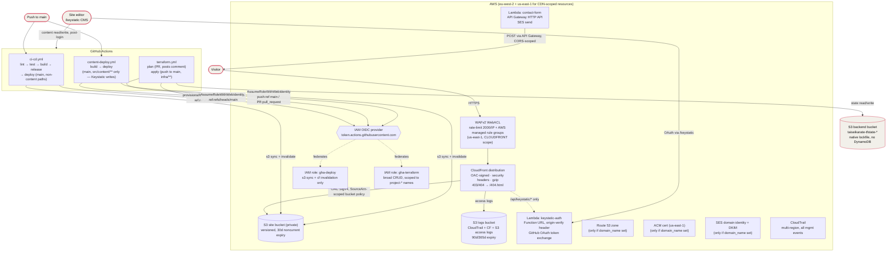

# taisei-karate — AWS static site (Terraform)

Agent-oriented map of `taisei-karate`'s AWS deployment. **Not part of the Dokploy homelab** — different cloud, different auth model, own repo (`taisei-karate`, sibling to `foundry` under `imapps/`), own Terraform state. See [`homelab.md`](./homelab.md) for the Dokploy side.

Source of truth for this stack is the code: `taisei-karate/infra/*.tf` (Terraform) and `taisei-karate/.github/workflows/*.yml` (CI/CD). This doc is a map to orient in that code, not a replacement for it — when they disagree, the code wins; update this doc.

## 1. What it is

Astro static site, no servers. Built by GitHub Actions, uploaded to a private S3 bucket, served through CloudFront. Two small Lambdas handle the only dynamic bits: a contact-form mailer and a Keystatic (CMS) GitHub OAuth exchange.

## 2. Architecture

**Request path:** visitor → WAF → CloudFront (OAC-signed read from private S3). Bucket denies all public access; policy only allows `cloudfront.amazonaws.com` scoped to this distribution's ARN. `/api/keystatic/*` alone routes to the auth Lambda instead of S3.

**App deploy path (`ci-cd.yml` / `content-deploy.yml`):** push to `main` → GitHub Actions builds → assumes `gha-deploy` via OIDC (**no stored AWS keys**) → `aws s3 sync` (3 passes: immutable hashed assets, short-cache images, no-cache everything else) → CloudFront invalidation. Content-only edits (Keystatic writes under `src/content/**`) skip lint/test/release and use the lighter `content-deploy.yml` path; everything else uses `ci-cd.yml`.

**Infra deploy path (`terraform.yml`):** PR touching `infra/**` → `terraform plan` via `gha-terraform` (OIDC, `pull_request` sub claim) → plan posted as a PR comment (no branch-protection gate — private repo, no GitHub Pro — treat red plan as "don't merge", not a hard block). Push to `main` → `terraform apply` via the same role (`ref:refs/heads/main` sub claim, separate trust condition from the app-deploy role).

## 3. Resource inventory

| Resource | File | Notes |
|---|---|---|
| S3 site bucket | `s3.tf` | private, versioned, OAC-only read, 30d noncurrent-version expiry |
| S3 logs bucket | `logging.tf` | CloudTrail + CF + S3 access logs; `BucketOwnerPreferred` (LogDelivery ACL group still required) |
| S3 tfstate bucket | `backend.tf` | `taiseikarate-tfstate-777799876926`, eu-west-2, native S3 lock (TF ≥ 1.11), **pre-exists, not managed by this config** |
| CloudFront distribution | `cloudfront.tf` | OAC to S3, response-headers policy (HSTS/CSP/etc.), `keystatic_index` viewer-request function (directory-index rewrite + `domain_hidden` gate + Host header recovery) |
| ACM cert | `acm.tf` | us-east-1 only (CloudFront requirement); **skipped entirely while `domain_name` unset** |
| Route 53 zone + records | `route53.tf` | apex/`www` A+AAAA aliases to CloudFront, SPF, DMARC (`p=none`); **skipped while `domain_name` unset** |
| WAFv2 WebACL | `waf.tf` | us-east-1 (CLOUDFRONT scope); rate-limit (2000/IP) + AWS `CommonRuleSet` + `KnownBadInputsRuleSet`; logs to CloudWatch |
| Lambda `contact-form` | `contact.tf`, `functions/contact-form/` | Node 20, behind API Gateway HTTP API (`POST /contact`), 5rps/10burst throttle, sends via SES |
| Lambda `keystatic-auth` | `lambda.tf`, `functions/keystatic-auth/` | Node 20, public Function URL, gated by a random `x-origin-verify` header only CloudFront sets |
| SES domain identity + DKIM | `contact.tf` | 3 CNAME DKIM records; **skipped while `domain_name` unset** — contact form 500s until this + `contact_from_address` are set |
| CloudTrail | `logging.tf` | multi-region, all management events, log-file validation on |
| IAM OIDC provider | `oidc.tf` | `token.actions.githubusercontent.com`; only one per URL per account — `terraform import` if one already exists |
| IAM role `gha-deploy` | `oidc.tf` | narrow: `s3:PutObject/DeleteObject/ListBucket` on site bucket + `cloudfront:CreateInvalidation` |
| IAM role `gha-terraform` | `oidc.tf` | broad but name-scoped (`${project}-*`) CRUD across S3/CloudFront/ACM/Route53/WAF/Lambda/API Gateway/SES/CloudTrail/IAM; trusts both `ref:refs/heads/main` (apply) and `pull_request` (plan) sub claims |

## 4. Domain status

`domain_name` defaults to `""` in `variables.tf` and is **not currently set** in `terraform.tfvars` (only `tfstate_bucket` is). Practical effect while unset:

- Site is reachable **only** at the `*.cloudfront.net` URL (`terraform output -raw cloudfront_url`) — no Route 53 zone, no ACM cert, no SES identity exist yet.
- Contact form deploys but sending fails (SES identity not verified) until a domain is attached.
- `var.domain_hidden` (default `false`) can 403 the real domain while staging pre-launch, without taking down the CloudFront URL.

Going live on a real domain = set `domain_name` (+ delegate the printed `route53_name_servers` at the registrar) → re-apply → verify SES identity → set `contact_from_address` → re-apply again.

## 5. Secrets & auth model

- **No long-lived AWS credentials anywhere.** Both GitHub Actions roles are assumed via OIDC (`aws-actions/configure-aws-credentials` + `role-to-assume`), scoped by the token's `sub` claim (branch ref for deploy/apply, `pull_request` for plan).
- App-level secrets (`KEYSTATIC_GITHUB_CLIENT_SECRET`, `KEYSTATIC_SECRET`) live as **GitHub Actions secrets**, injected as `TF_VAR_*` at plan/apply time — never committed, never in `terraform.tfvars` (gitignored).
- Non-secret config (`S3_BUCKET`, `CLOUDFRONT_DISTRIBUTION_ID`, `AWS_DEPLOY_ROLE_ARN`, `AWS_TERRAFORM_ROLE_ARN`, `AWS_REGION`, `SITE_URL`, `CONTACT_API_URL`, `TFSTATE_BUCKET`, `DOMAIN_NAME`, `DOMAIN_HIDDEN`) lives as **GitHub Actions repo variables** — all read from `terraform output` after the first apply, see `infra/README.md` for the exact `gh variable set` commands.
- The `keystatic-auth` Lambda's `x-origin-verify` secret (`random_password.origin_verify`) is Terraform-generated at apply time, injected into both the Lambda env and CloudFront's custom origin header — never leaves AWS.

## 6. Gotchas checklist (for future agents)

- [ ] `terraform plan`/`apply` needs `functions/contact-form/dist/index.mjs` and `functions/keystatic-auth/dist/index.mjs` to **already exist** — Terraform reads them at plan time for the source hash. Run `bun run build:contact-lambda && bun run build:lambda` first (CI does this automatically).
- [ ] A fork PR touching `infra/**` cannot get real AWS credentials — `terraform.yml`'s plan job gates on `head.repo.full_name == github.repository` (OIDC's `pull_request` sub claim alone can't distinguish same-repo vs fork).
- [ ] If the AWS account already has a GitHub OIDC provider from something else, `terraform import` it first — AWS allows only one per URL per account.
- [ ] Contact form CORS deliberately excludes `http://localhost:4321` — `bun run dev` cannot exercise the real deployed API; that's intentional, not a bug.
- [ ] No branch-protection gate on the Terraform `plan` job (private repo, no GitHub Pro) — a red plan doesn't physically block merge, just means don't.
- [ ] `gha-terraform`'s IAM statement is deliberately broad in places (`Resource "*"` for CloudFront/ACM/WAF) because those ARNs don't exist until AWS assigns them — see per-statement comments in `oidc.tf` before tightening.
- [ ] This stack and the Dokploy homelab (`foundry`) **share nothing** — no common DNS, no common secrets, no common deploy path. Don't assume a `foundry` gotcha applies here or vice versa.
